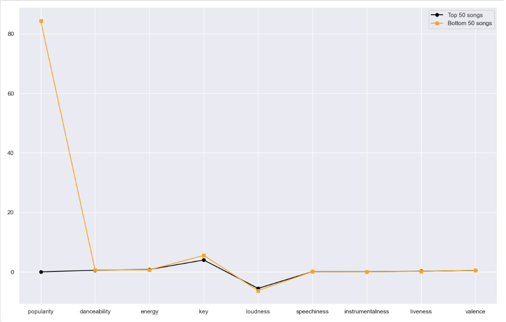
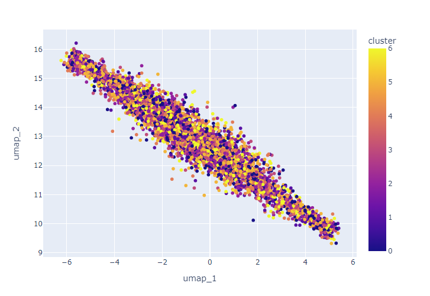

# Building a Music Recommendation System

## Project Motivation
Music is a valuable source of entertainment. It allows us to immerse ourselves in the rhythm of songs and listen to the words that seem like they are telling our stories. However, discovering new music could be a challenge. The inspiration for this project was the "More recommended songs" at the bottom of a user playlist in Spotify.


While Spotify has space on its homepage for generated playlists based on user preferences, there is an opportunity to also use the space under the user's playlist to give recommendations to users. It can make the feeling more personalized based on the songs that they like to listen to. 

 ## Data Extraction

 The first step was sign up for a free account in spotify to get a client ID and key. After obtaining a client ID and key, the goal was to find a playlist that had a variety of songs from different genres to be able to create recommendations based on a multitude of factors. 
 
 There was a playlist which contained 6514 songs that had songs ranging from Bon Jovi to N.W.A and even Yodeling. Using the client ID and key as the access information for the Spotify API, a python package called "spotipy" was used to extract the necessary data. 

 The information retrieved from the API were:
 * Artist Name 
 * Artist ID
 * Popularity 
 * Album Name 
 * Track Name 
 * Track ID 
 * Danceability
 * Energy
 * Key 
 * Loudness
 * Mode
 * Speechiness               
 * Instrumentalness 
 * Liveness 
 * Valence
 * Tempo
 * Duration of the song 
 * Time Signature

## Understanding the Data
With the audio data extracted and each song having its corresponding information, it was time to see if there were any correlations or interesting pieces of information to take into consideration.

There were was only 1 song which did not include a piece of information so it was dropped from the dataset. Besides that, the dataset was clean did not need much processing.

Using a heatmap, I was able to check whether there were correlated features or not. 


The only seemingly high correlated features were "Loudness" and "Energy". It was not necessarily a cause for concern. 

There were checks of the distributions of each variable and while some of the features like "Energy", "Loudness", and "Speechiness" were skewed, they were still necessary components.

However, when taking the mean of the features for the top 50 songs (sorted by popularity) and the bottom 50 songs, it showed that besides popularity the means of the top 50 songs and bottom 50 songs were almost the same.



## The Modeling Process
 For the modeling process, the numeric features were used which excluded Artist Name, Artist ID, Album Name, Track ID. In order to be able to create a recommendation system, clustering would have to be used. Clustering allows for information to be grouped based on similarities. The featured were scaled using Standard Scaler as each of the features have different ranges.
 
 However, in working with 13 features, I also wanted to reduce the dimensionality of the data without sacrificing significant important information. Two processes of Dimensionality Reduction were used to preprocess the information. One was UMAP and the other was PCA. Each Dimensionality Reduction has its own advantages in its approach to reducing the dimensions. 

 After the data went through Dimensionality Reduction, it went through a clustering algorithm. The clustering algorithms used were:

 * Kmeans
 * Agglomerative Clustering
 * Birch
 * Minibatch KMeans
 * Gaussian Mixture

This process was iterated through in 5 ways:

<u><b>First iteration</b></u>

Each model type starts with the data being scaled and no dimensionality reduction used. The outcome produced after the scaling is inputted into the clustering algorithm with the default hyperparameters for the model selected. This iteration is considered the baseline.

<u><b>Second iteration</b></u>

Each model type starts with a pipeline that includes a scaler (Standard Scaler), a Dimensionality Reduction Technique (UMAP) and a ML Clustering Algorithm (One of the 5 mentioned above.) The default hyperparameters for the model is selected.

<u><b>Third iteration</b></u>

Each model type starts with a pipeline that includes a scaler (Standard Scaler), a Dimensionality Reduction Technique (PCA) and a ML Clustering Algorithm (One of the 5 mentioned above.) The default hyperparameters for the model s selected. The hyperparameter for PCA "n_components" is 9 components as it kept more than 80% of the variance of the data.

<u><b>Fourth iteration</b></u>

Each model type starts with a pipeline that includes a scaler (Standard Scaler), a Dimensionality Reduction Technique (UMAP) and a ML Clustering Algorithm (One of the 5 mentioned above.) A parameter grid is created with different hyperparametic features and different values in those feature. The pipeline and parameter grid are then inputted into a GridSearchCV to find the best model. 

<u><b>Fifth iteration</b></u>

Each model type starts with a pipeline that includes a scaler (Standard Scaler), a Dimensionality Reduction Technique (PCA) and a ML Clustering Algorithm (One of the 5 mentioned above.) A parameter grid is created with different hyperparametic features and different values in those feature. The pipeline and parameter grid are then inputted into a GridSearchCV to find the best model to use. 

## The Evaluation Process

Unsupervised learning has a slight unique evaluation compared to supervised learning due to the lack of "ground truth" labels. The way each model was evaluated using a  Silhouette Score

The Silhouette Score is a score from -1 to 1. Scores in the negative range typically indicate that a sample was assigned to the wrong cluster. A score around 0 indicates that clusters are overlapping. A score closer to 1 indicates that clusters are more clearly defined. 

A visualization was produced to also see how well the clusters were produced.

Picture of clusters from Model 1 in "The Results"


Picture of clusters from Model 2 in "The Results"


## The Results

Two final models were chosen for the recommendation engine.

<b><u>Model 1</u></b>

Baseline MiniBatch KMeans with PCA

<b>Silhouette Score</b>  

0.06486605443112133 


<b><u>Model 2</u></b>

MiniBatchKMeans with UMAP

<b>Silhouette Score</b>

-0.04891443927137089


## The Recommendation Engine

The recommendation engine could be used by running streamlit on the final_recsys_py.py file or the final_recsys_pca_py.py file. It was used in the demonstration of the recommendation engine.


## The Conclusion

Based on the Silhouette Scores of the models and the visualizations of the clusters, there needs to be more information given to the models to make better clusters for the recommendation engine. Given the results during the EDA where the means of the top 50 songs and bottom 50 songs were almost the same, it was difficult for the algorithm to differentiate the clusters well.

Model 1 in the results was better than random guessing which is a solid start to making as great recommendation engine.

Model 2 had a negative Silhoutte score to it may be guessing too wildly however, it was also not too far from 0 where the clusters would overlap.

While the audio features may have not been the discerning factor for the algorithm, more information can be given such as genre, lyrics or other audio data that can strengthen the model and produce more distinct clusters for the recommendation engine.

## For More Information
See the full analysis in the Jupyter Notebook or review this presentation:

[Modeling Notebook](/eda_model_notebook.ipynb)

[Presentation](/music_rec_presentation.pdf)

## References
### Gathering playlist information
[Github - Max Hilsdorf](https://towardsdatascience.com/how-to-create-large-music-datasets-using-spotipy-40e7242cc6a6)

[Stack Overflow](https://stackoverflow.com/questions/39086287/spotipy-how-to-read-more-than-100-tracks-from-a-playlist)

### Building a recommendation system

[How to build an amazing music recommendation system - Amol Mavuduru](https://towardsdatascience.com/how-to-build-an-amazing-music-recommendation-system-4cce2719a572)

### Silhouette Scorer for Gridsearch

[Stack Overflow](https://stackoverflow.com/questions/44636370/scikit-learn-gridsearchcv-without-cross-validation-unsupervised-learning)

### UMAP Parameter  Visualization
[UMAP Documentation](https://umap-learn.readthedocs.io/en/latest/parameters.html)


## Additional Info
For additional info, contact Jonathan Roman at [jonathan.roman1213@gmail.com](mailto:jonathan.roman1213@gmail.com)


## Repository Structure

```
├── data
├── images
├── .gitignore
├── README.md
├── eda_model_notebook.ipynb
├── environment.yml
├── final_recsys_notebook.ipynb
├── final_recsys_pca_notebook.ipynb
├── final_recsys_pca_py.py
├── final_recsys_py.py
├── finalized_model.pkl
├── finalized_model_pca.pkl
├── generating_dataset.ipynb
└── music_rec_presentation.pdf
```
